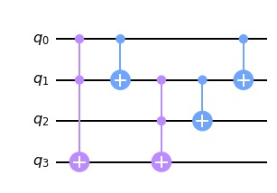

# Quantum Full Adder in Qiskit

Jupyter notebook of a quantum full adder in Qiskit.  Example of two bit addition provided.

Inputs:  q0=A q1=B q2=Carry In

Outputs: q2=Sum(A+B) q3=Carry Out

Based on circuit diagram from [Quantum Inspire Code example: Quantum full adder](https://www.quantum-inspire.com/kbase/full-adder/)
